# Digital-Image-Processing-Basic
## Introduction
Digital image processing Basic algorithm there,Try to use the image processing code in different folders to complete all kinds of interesting functions!

## Installation Dependencies:
- C ++
- oepncv

## Visualization
### origin picture:
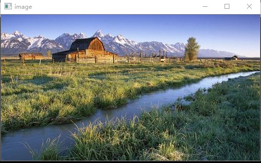
### inverse:
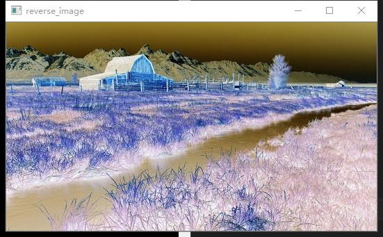
### histogram:
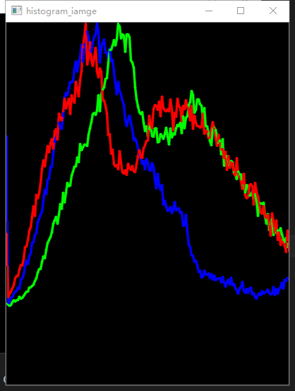
### Otsu:
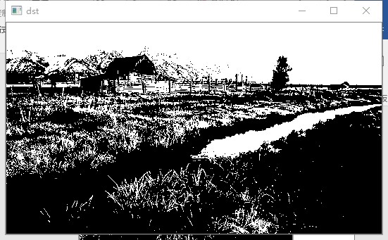
### Spectrum_map:
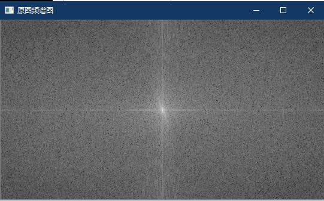
### ideal_low_pass:
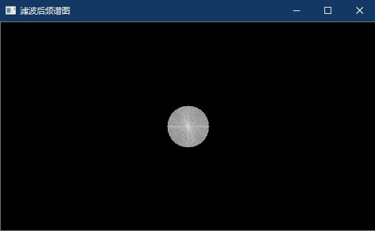
### ideal_low_pass_output:

### Butterworth_low_pass:
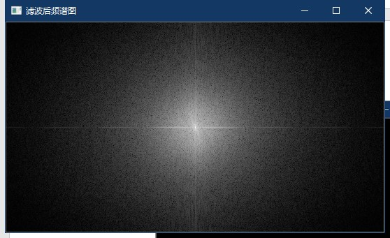
### Butterworth_low_pass_output:
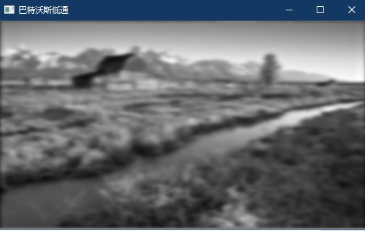
### Gauss_low_pass:
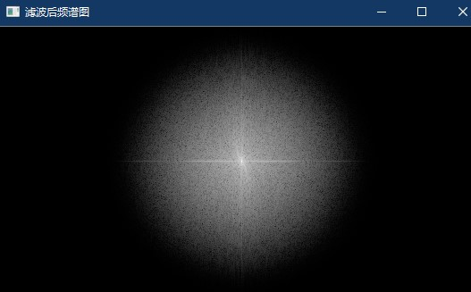
### Gauss_low_pass_output:
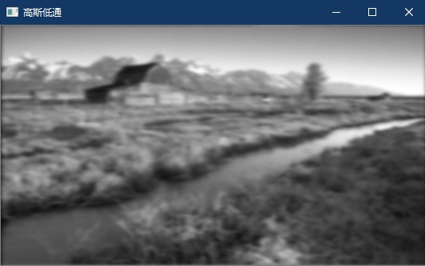
### image_segmentation:
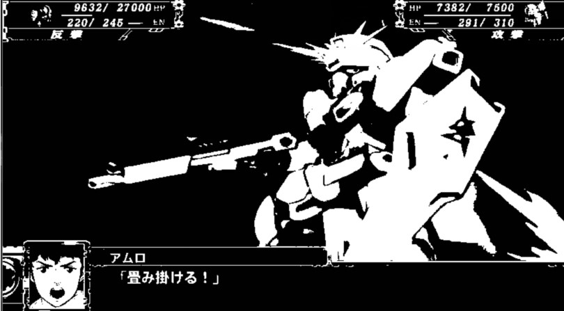
### origin_man:
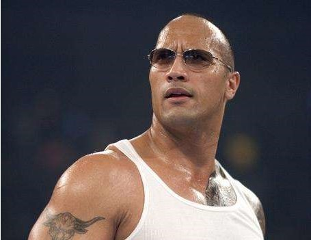
### segmentation_man:
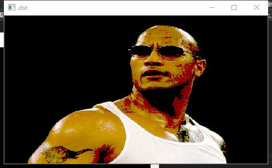
### origin_space:
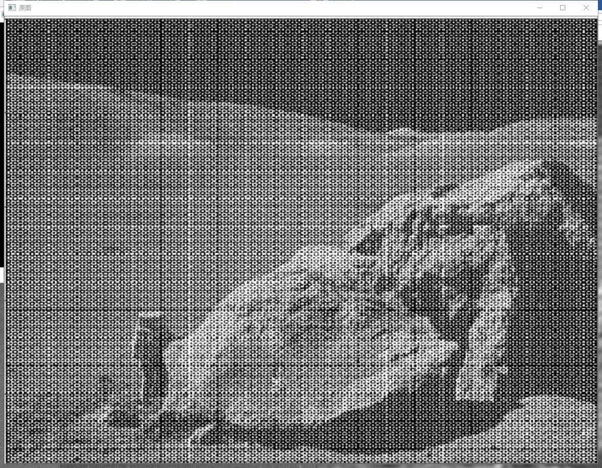
### Butterworth_band_stop:
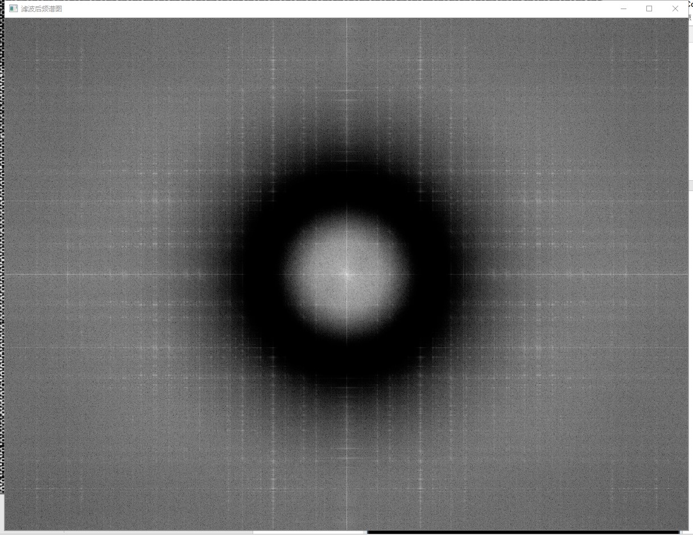
### band_stop_space:
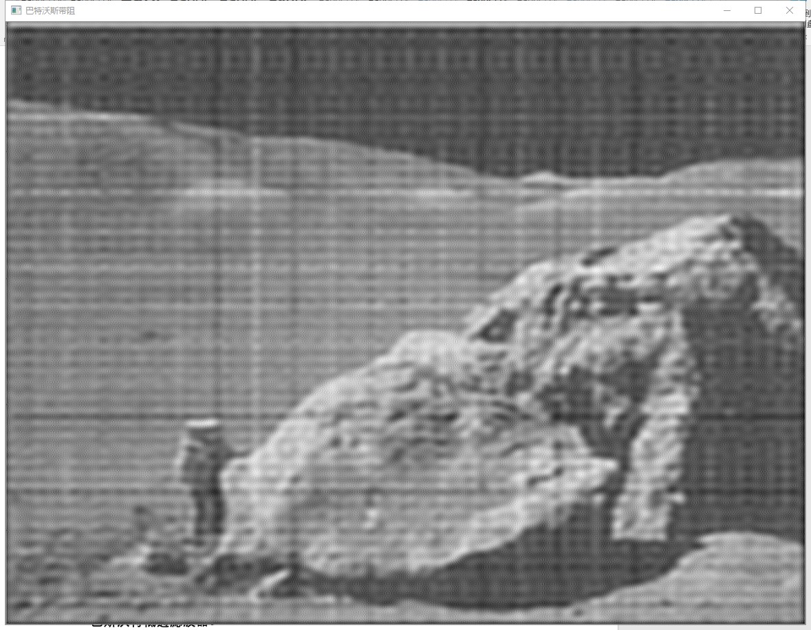
